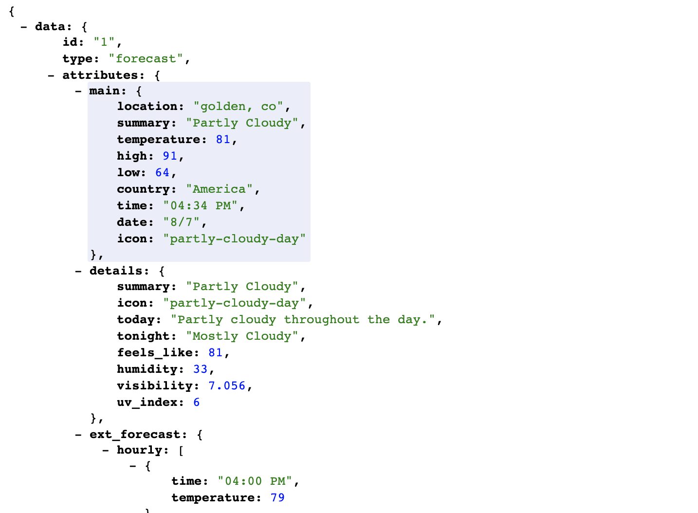
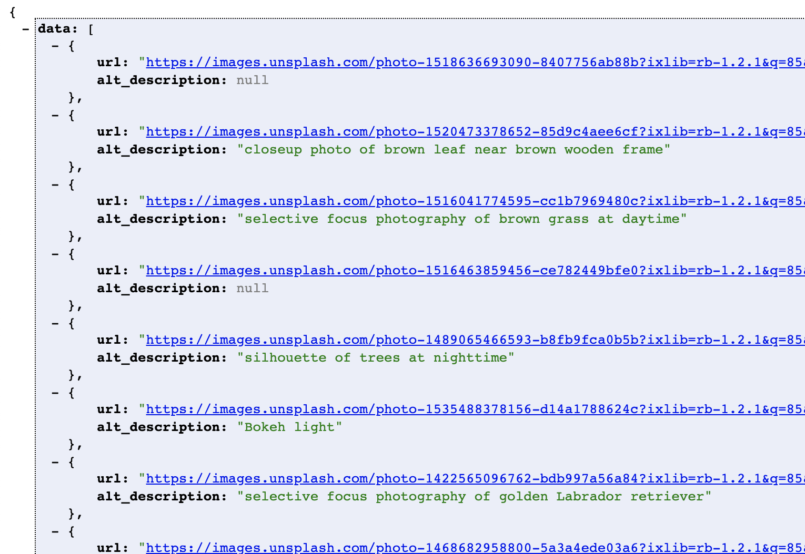
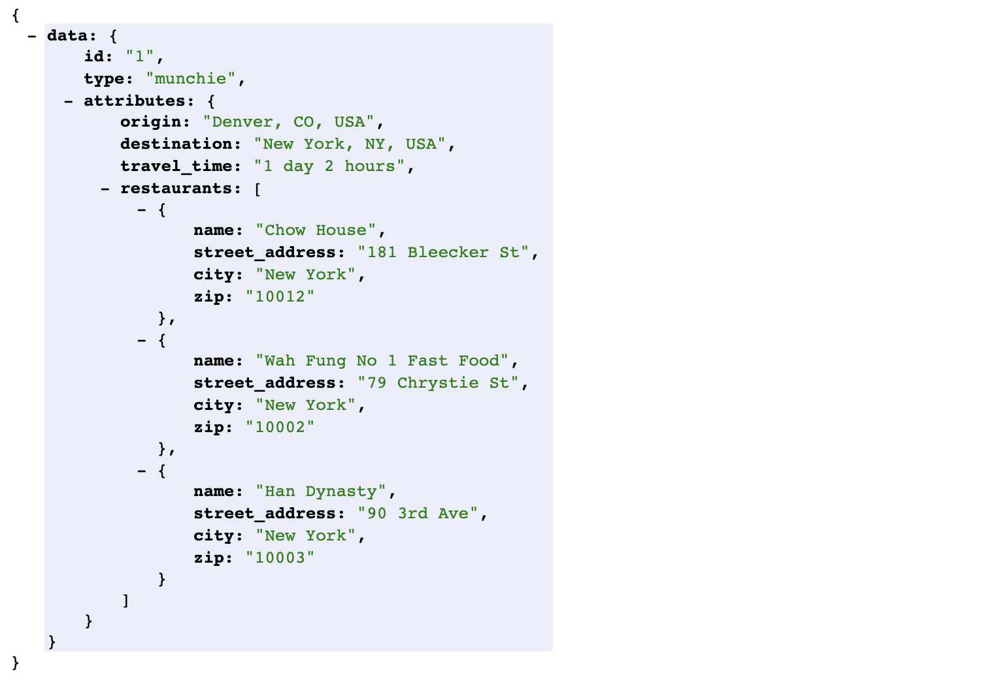

# Whether Sweater

This is an api that can create and log in users. It can give the hourly and extended forecast for an area, give backgrounds for city forecast pages, give time traveled and open restaurants for end and start points given, and can give road trip information with required key and start and endpoint.

### Installing

Clone Repo

```
bundle install
bundle exec rails db:{create,migrate}
bundle exec rails server
```

travel to:
```
localhost:3000
```

## Running the tests

Running all tests
```
bundle exec rspec
```

Running api requests spec
```
bundle exec rspec spec/requests
```

uses:
- RSpec
- Shoulda-Matchers
- VCR and Webmock
- Travis CI

## Deployment

[https://arcane-hollows-93312.herokuapp.com/](https://arcane-hollows-93312.herokuapp.com/)

## Built With

* [Rails](https://rubyonrails.org/)
* [Bundler](https://bundler.io/)

## Authors

* **Vince Carollo** - *Solo* - [VinceCarollo](https://github.com/VinceCarollo)

## Endpoints
#### /api/v1/forecast?location=golden,co

gives main forecast, details, and extended hourly and daily forecasts



#### /api/v1/backgrounds?location=golden,co

gives background images of city for forecast page



#### /api/v1/munchies?start=denver,co&end=new%20york,ny&food=chinese

gives 3 restaurants that are open upon arrival of end address that adhere to food type input



#### /api/v1/users

allows the creation of users and return api key assigned

body:
```json
{
  "email": "example_user@example.com",
  "password": "pass",
  "password_comfirmation": "pass"
}
```

return:
```json
{
    "status": 201,
    "body": {
        "api_key": "EXAMPLE_KEY_HERE"
    }
}
```

#### /api/v1/sessions

allows user to see api key assigned and login

body:
```json
{
  "email": "example_user@example.com",
  "password": "pass"
}
```

return:
```json
{
    "status": 201,
    "body": {
        "api_key": "EXAMPLE_KEY_HERE"
    }
}
```

#### /api/v1/road_trip

gives time traveled to destination and forecast upon arrival (must use valid api key)

body:
```json
{
  "origin": "denver,co",
  "destination": "kansas city,mo",
  "api_key": "EXAMPLE_KEY_HERE"
}
```

return:
```json
{
    "data": {
        "id": "1",
        "type": "road_trip",
        "attributes": {
            "origin": "Denver, CO, USA",
            "destination": "Kansas City, MO, USA",
            "travel_time": "8 hours 41 mins",
            "forecast": {
                "summary": "Partly Cloudy",
                "temperature": 82
            }
        }
    }
}
```
